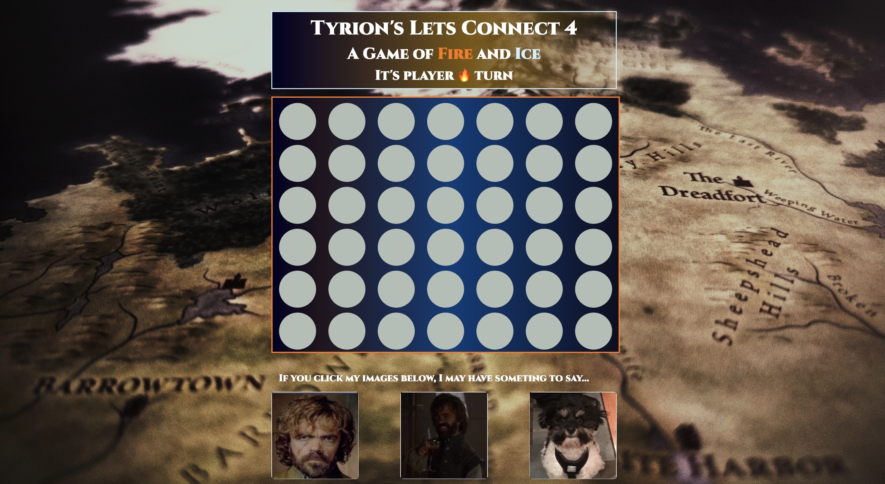

# tyrions-connect-four-game

Tyrion's Connect Four is a Connect Four game based on the books and series Game of Thrones! You can start the game by clicking the circles on the board which will drop the pieces into place. The color pieces are orandg for and light blue. The objective of the game is to get four colors in a row either horizontally, vertically, or diagonally. If the either player gets a four-in-a-row, they win the game and a message will let them know. If the game ends in a tie, there's a message to let the users know. Game can be reset at any time once it is started. If a player wins, confetti will drop from the top of the browser. There are three images at the bottom, that when clicked, will play a sound depending on which tile is clicked.

## PLAY THE GAME HERE: [Tyrion's Connect Four](https://tyrions-lets-connect-game.netlify.app/)

### Languages used 🗯

 * HTML
 * CSS
 * JavaScript
 * git

First tyrion image: https://mobile.twitter.com/got_tyrion
Tyrion happy - https://rstudio-pubs-static.s3.amazonaws.com/376023_b04b6149e6664d949b065bbe0e89b4e4.html
Third Tyrion image was my personal photo.
Gradient picker: https://cssgradient.io/
Audio files: https://www.101soundboards.com/boards/23374-tyrion-lannister-soundboard

